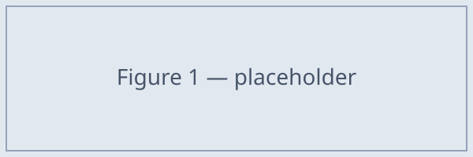

# The galley loop

This document exercises the thinnest end-to-end path: parse, measure, pack into
exact A4 pages, and emit a PDF. The prose here is split into per-block atomic
units, each measured at the true body width and placed so that no page ever
overflows its 269 mm content box.

Each paragraph is its own atomic unit, so a run of prose flows naturally across
page boundaries — the packer places as many units as fit, then starts a fresh
page. Nothing here is hand-placed; the geometry is computed.

## Keeping things together

The figure and its caption below are wrapped in a `::: keep` block, which fuses
them into a single atomic unit. If the pair does not fit in the space remaining
on the current page, the whole unit moves to the next page rather than letting
the caption orphan away from its figure.

::: keep
{width=120mm}

**Figure 1.** A figure and its caption travel together as one unit.
:::

## Themed components

Themed components are keep-together by default and render through the theme's
mustache template — here, a finding card shipped by the built-in theme.

::: finding-card amber {icon=A title="Regulatory risk"}
The import framework does not yet cover AI-ready hardware, so timelines depend on
a licensing decision outside the venture's control.
:::

::: finding-card emerald {icon=B title="Channel advantage"}
Distribution through the existing CIMEX retail network shortens time-to-market
for every product line in the catalogue.
:::

\newpage

## After a hard break

The `\newpage` above forced this section onto a fresh page regardless of how much
room remained. This is the author's coarsest control knob; keep-together and
automatic flow handle everything else.
